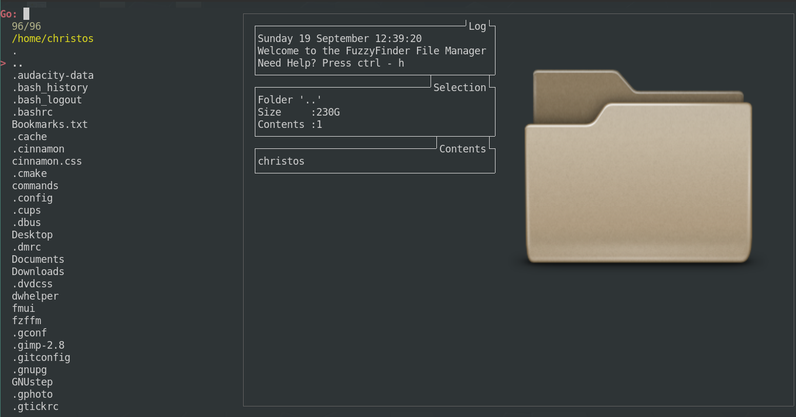
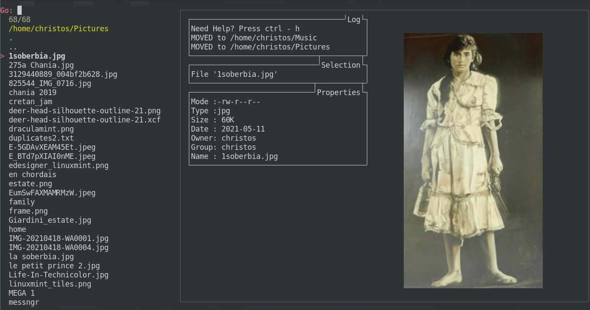
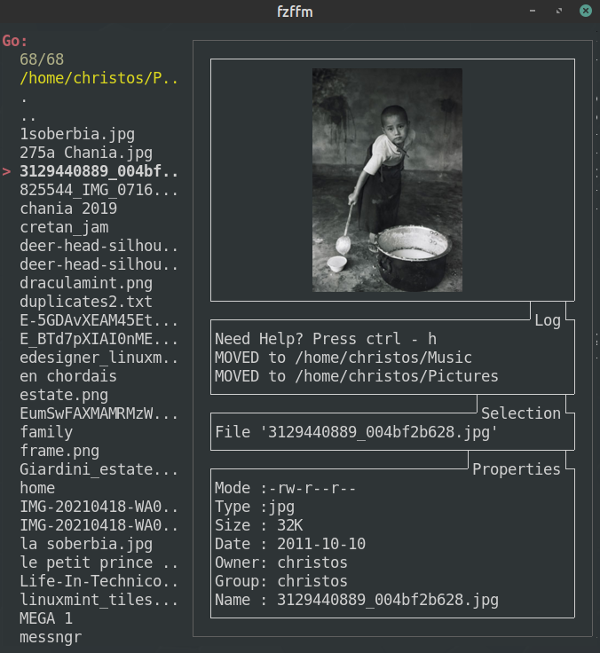
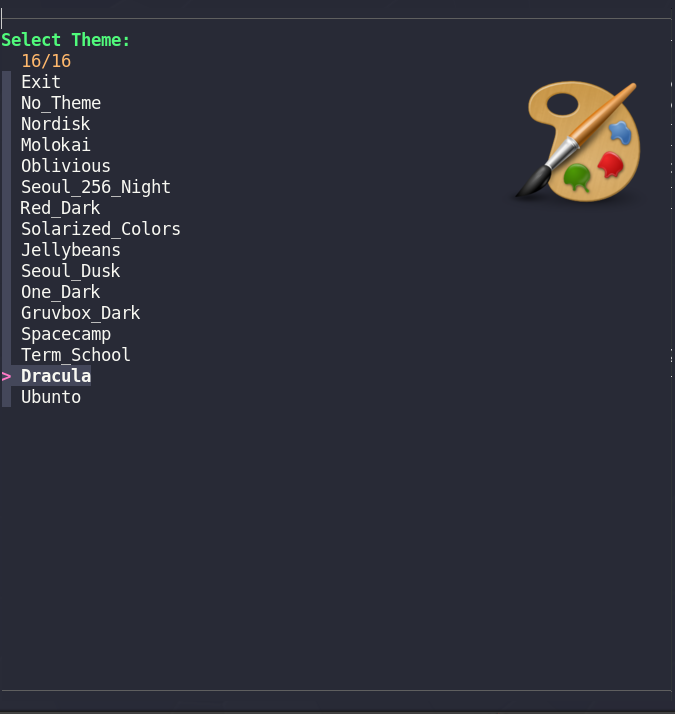
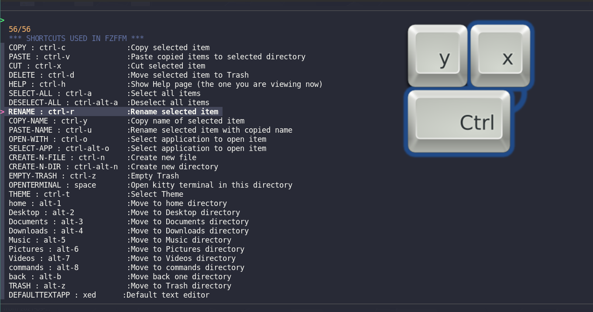
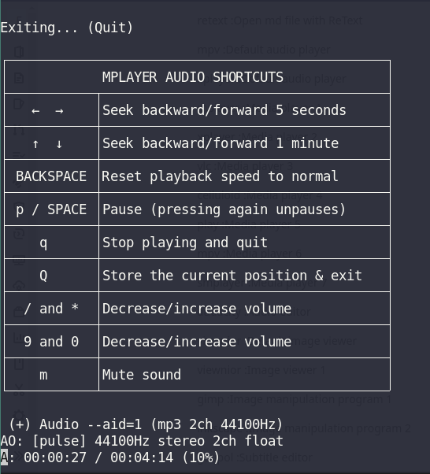

# fzffm

## A command line file manager that supports image previews, (among other features). 

It is highly costumizable as far the keyboard bindings, the shortcuts and the applications that can be used.

It is a simple script in bash.This command line file manager provides image preview (among other features). The name is quite self explanatory: Fuzzy Finder File Manager. Obviously it uses fzf to navigate to and select files and directories.

 The terminal emulator used is **kitty** (thus the easy image preview).
Shortly a new edition will be uploaded to run this script on *any  other known terminal emulator*, using **uberzug**.

Other dependencies are **rofi** (I use it with the open-with(ctrl-o) shortcut, and I can select with it the application with which I can open a file). I also use other applications as default to open various file types, as xed for .txt, viewnior for images, libreoffice for office files etc. However the user can edit the configuration file and  fill in his prefered and already installed applications.  

FZFFM is highly configurable, because by tweeking a simple .conf file, you can set your preferred applications, default or not, AND preferred shortcuts for various actions, AND preferred bookmarks to navigate in the file system.

---

## INSTALL

**Open terminal from fzffm directory, make fzffm.sh executable:**

    cd ~/fzffm

    chmod +x fzffm.sh

**Copy files to .cache, .config:**

    cp -r fzffm-cache/ ~/.cache/fzffm/

    cp -r fzffm-config/ ~/.config/fzffm/

    
---

## DEPENDENCIES

    sudo apt install kitty fzf rofi imagemagick odt2txt catdoc epub-thumbnailer pdftoppm pdftotext
    
    or, depending on your system: 
    
    sudo pacman -S kitty fzf rofi imagemagick odt2txt catdoc epub-thumbnailer pdftoppm pdftotext

Edit **~/.config/fzffm/.conf** to your preferable installed applications, to make sure that files get opened by applications.

---

## RUN

 **From terminal run:**

    kitty ~/fzffm/fzffm.sh 
---
## KEY BINDINGS

| Key    |   Action   |
|-----|-----|
|  ⭡ ⭣ (arrow up - down)    |   Move up-down |
| ⭢(arrow right), Enter     | Select    |
| ⭠(arrow left)     |  Move one directory up    |
|  ctrl-c    |   Copy selected item   |
|  ctrl-v    |   Paste copied items to selected directory  |
| ctrl-x  |   Cut selected item  |
|   ctrl-d   |   Move selected item to Trash  |
|  ctrl-h    |   Show Help page (the one you are viewing now)   |
|  ctrl-a    |  Select all items   |
|   ctrl-alt-a   |   Deselect all items   |
| ctrl-r  |          Rename selected item |
| ctrl-y  |       Copy name of selected item |
| ctrl-u  |     Rename selected item with copied name |
| ctrl-o  |       Select application to open item|
| ctrl-alt-o |   Select application to open item |
| ctrl-n  |   Create new file  |
| ctrl-alt-n | Create new directory|
| ctrl-z  |     Empty Trash|
| space   |    Open kitty terminal in this directory   |
| ctrl-t   |          Select Theme |

##  BOOKMARKS

These Bookmarks again are quite arbitrary, the user can alter them to their prefernce editing **~/.config/fzffm/.conf**

| Key    |   Directory|
|-----|-----|
| alt-1   |           Move to home directory|
| alt-2   |       Move to Desktop directory |
| alt-3   |     Move to Documents directory |
| alt-4   |    Move to Downloads directory  |
| alt-5   |         Move to Music directory |
| alt-6   |      Move to Pictures directory |
| alt-7   |         Move to Videos directory |
| alt-8   |       Move to commands directory |
| alt-b   |            Move back one directory|
| alt-z   |           Move to Trash directory |
 
##  DEFAULT APPLICATIONS

These applications work for me, naturally the user can alter them to the applications of their preference, editing **~/.config/fzffm/.conf**

| Application| Assigned |
|    ------  |  ------  |
| xed   |   Default text editor|
| xed   |        Text editor 1 |
| nano    |      Text editor 2 |
| mousepad   |   Text editor 3 |
| bash  |        Open selected script with bash |
| retext  |     Open md file with ReText |
| mpv   |      Default audio player |
| xplayer |     Media player 1 |
| xplayer |     Media player 2 |
| vlc     |      Media player 3|
| celluloid  |  Media player 4 |
| play      |    Media player 5|
| mpv       |    Media player 6|
| smplayer   |   Media player 7|
| audacity   |   Audio editor  |
| viewnior   |  Default image viewer |
| viewnior   |    Image viewer 1 |
| gimp       |    Image manipulation program 1 |
| inkscape   |    Image manipulation program 2 |
| gaupol     |    Subtitle editor|
| libreoffice|  Office suite   |
| xreader    |      Pdf Reader |
| brave-browser |  Default web browser |
| brave-browser  | Web Browser 1|
| firefox    |     Web Browser 2 |
| xed     |        Text Editor |
| kitty   |    Terminal |
